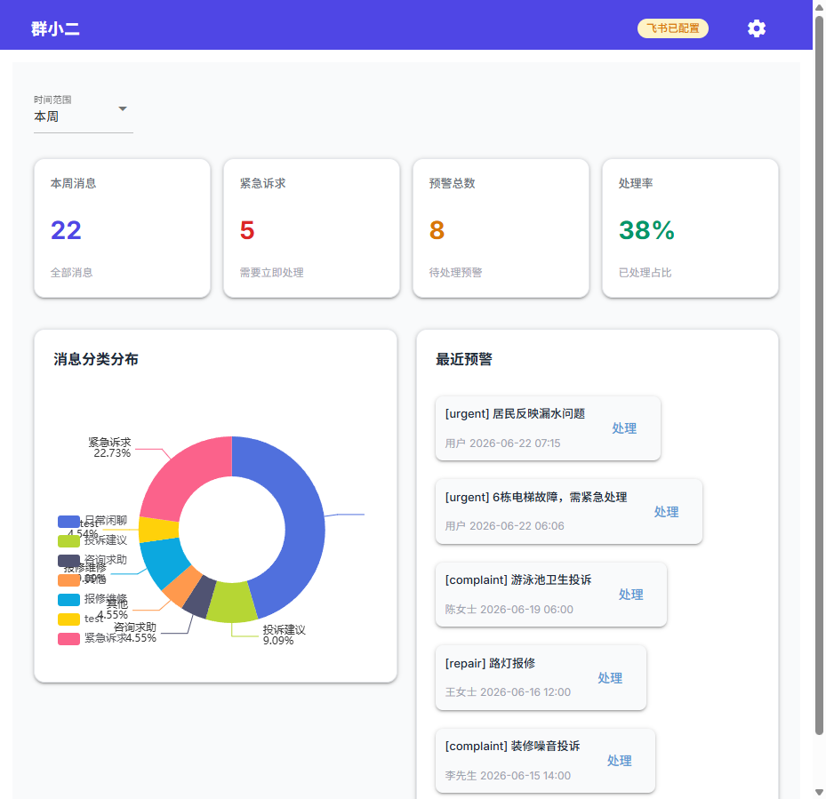
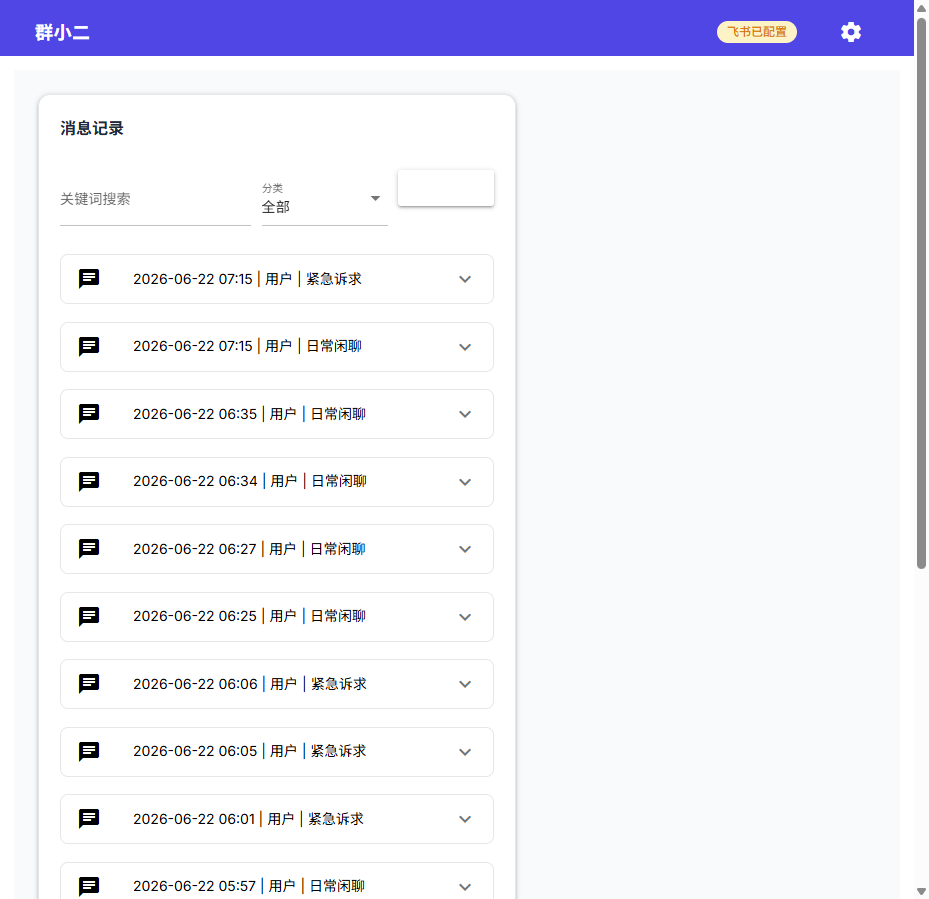
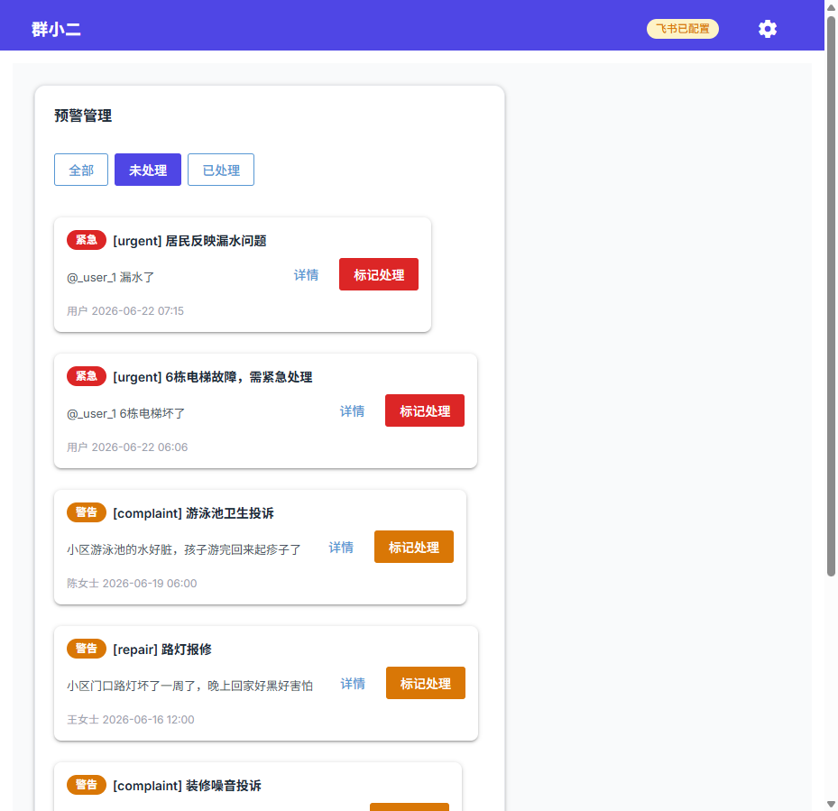
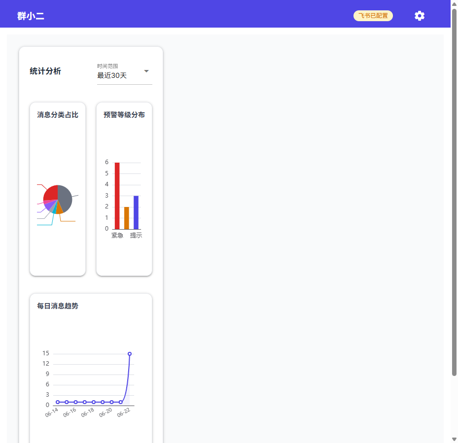
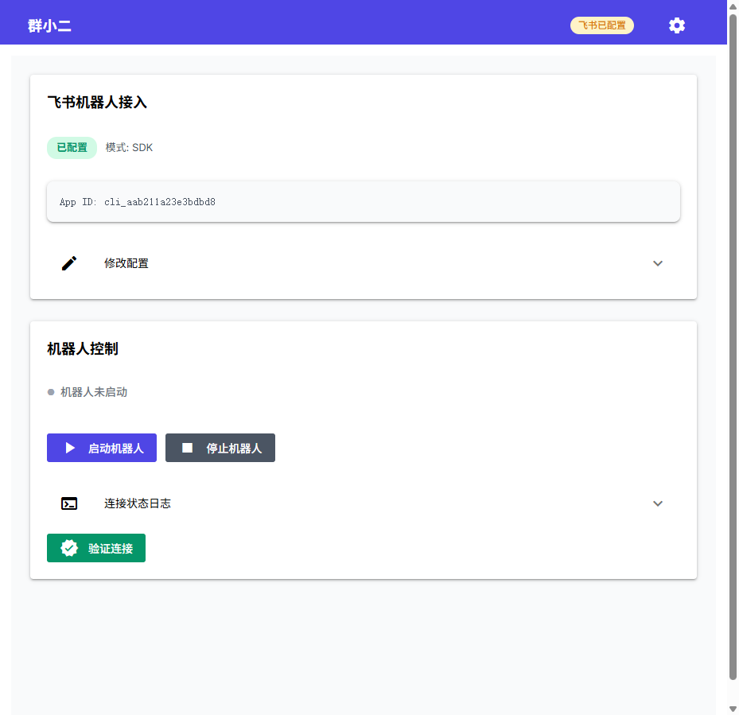

# 群小二 - 群众诉求智能分拣与预警系统

> AI+场景创客营 · 企业AI场景实战课程作业

## 项目立项

| 项 | 内容 |
|----|------|
| **项目代号** | 「群小二」AI小组 |
| **场景主题** | **「AI邻里情报员」**——24小时在线的群众诉求智能分拣与预警系统 |
| **目标用户** | 社区网格员、物业管理人员 |
| **核心价值** | AI替代人工完成信息筛查，让网格员专注于解决实际问题 |

## 痛点分析

社区治理高度依赖微信群/飞书群，但网格员往往身兼数职，无法 24 小时盯着几十个群。大量居民诉求（如电梯故障、漏水、噪音）被刷屏淹没，导致小矛盾升级为大冲突。

> **核心矛盾**：基层网格员「看不过来、管不过来、易漏报」

**群小二**通过 AI 自动筛选关键信息，实现「小事不出群，大事早预警」。

## 价值描述

| 维度 | 价值 |
|------|------|
| **降本增效** | AI 替代人工完成信息筛查，网格员专注于解决实际问题而非「找问题」 |
| **预防矛盾** | 早发现、早介入，将邻里纠纷扼杀在萌芽状态，提升居民满意度 |
| **数据资产** | 积累高频问题数据库，为精准治理提供数据支撑 |

## 技术架构

```
┌─────────────────────────────────────────────────────────────┐
│                      群小二系统架构                          │
├─────────────────────────────────────────────────────────────┤
│                                                             │
│   ┌──────────┐      ┌──────────────┐      ┌──────────────┐ │
│   │ 飞书群   │ ──── │ 飞书机器人   │ ──── │  后端服务    │ │
│   │ (居民)   │      │ (SDK长连接)  │      │  (Python)    │ │
│   └──────────┘      └──────────────┘      └──────┬───────┘ │
│                                                   │         │
│                              ┌────────────────────┼───────┐ │
│                              │                    │       │ │
│                              ▼                    ▼       │ │
│                       ┌──────────────┐     ┌───────────┐  │ │
│                       │  LLM服务     │     │  SQLite   │  │ │
│                       │ (DeepSeek)   │     │  数据库   │  │ │
│                       └──────────────┘     └───────────┘  │ │
│                              │                             │ │
│                              ▼                             │ │
│                       ┌──────────────┐                     │ │
│                       │  管理后台    │                     │ │
│                       │  (NiceGUI)   │                     │ │
│                       └──────────────┘                     │ │
│                                                            │ │
└────────────────────────────────────────────────────────────┘ │
```

### 核心模块

| 模块 | 文件 | 功能 |
|------|------|------|
| 配置管理 | `src/config.py` | 统一配置管理 |
| LLM服务 | `src/llm_service.py` | 支持Ollama和API两种模式 |
| 飞书机器人 | `src/feishu_bot.py` | 消息监听、事件处理（Webhook模式） |
| 飞书机器人SDK | `src/feishu_bot_sdk.py` | 消息监听、事件处理（SDK长连接模式） |
| 数据库 | `src/database.py` | SQLite数据存储 |
| 管理后台 (Web) | `src/web_nicegui.py` | NiceGUI Web界面 (ECharts图表) |
| 管理后台 (桌面) | `src/desktop_gui.py` | Tkinter原生桌面GUI |
| 主程序 | `src/main.py` | 程序入口 |

### 技术栈

- **后端**：Python 3.10+
- **LLM**：DeepSeek API (也支持Ollama本地 / 通义千问)
- **数据库**：SQLite
- **前端**：NiceGUI (Web) + Tkinter (桌面)
- **图表**：ECharts
- **消息平台**：飞书开放平台 (SDK长连接)
- **消息平台**：飞书开放平台（支持Webhook和SDK两种接入方式）

## 快速开始

### 方式一：一键启动（推荐）

**Linux/Mac:**
```bash
chmod +x run.sh
./run.sh          # 启动全部服务
./run.sh test     # 测试LLM连接
./run.sh check    # 检查环境配置
```

**Windows:**
```cmd
run.bat           # 启动全部服务
run.bat test      # 测试LLM连接
run.bat check     # 检查环境配置
```

### 方式二：手动启动

### 1. 环境准备

```bash
# 克隆项目
git clone <repo-url>
cd qunxiaoer

# 安装依赖
pip install -r requirements.txt
```

### 2. 配置

```bash
# 复制配置文件
cp .env.example .env

# 编辑配置
vim .env
```

#### 配置说明

**方式一：使用Ollama（本地部署，免费）**

```bash
# 安装Ollama
curl -fsSL https://ollama.com/install.sh | sh

# 下载模型
ollama pull qwen2:7b

# 配置.env
LLM_MODE=ollama
OLLAMA_BASE_URL=http://localhost:11434
OLLAMA_MODEL=qwen2:7b
```

**方式二：使用API（开箱即用）**

```bash
# 配置.env
LLM_MODE=api
API_KEY=your-api-key-here
API_BASE_URL=https://dashscope.aliyuncs.com/compatible-mode/v1
API_MODEL=qwen-plus
```

### 3. 飞书机器人配置

1. 访问 [飞书开放平台](https://open.feishu.cn/)
2. 创建企业自建应用
3. 启用机器人能力
4. 配置事件订阅：
   - 请求地址：`http://your-server:8000/webhook/event`
   - 订阅事件：`im.message.receive_v1`
5. 获取 App ID、App Secret、Verification Token
6. 填入 `.env` 文件

#### 运行模式

系统支持两种运行模式：

| 模式 | 说明 | 适用场景 |
|------|------|----------|
| **Webhook** | 需要公网可访问的URL | 有公网IP或使用内网穿透（ngrok等） |
| **SDK** | 长连接模式，无需公网IP | 本地开发测试、无公网IP环境 |

在 `.env` 中配置：
```bash
BOT_MODE=webhook  # 或 sdk
```

也可以在 Web 管理界面中切换模式。

### 4. 启动服务

```bash
# 测试LLM连接
python src/main.py test

# 启动飞书机器人服务
python src/main.py bot

# 启动Web管理后台
python src/main.py web

# 同时启动两者
python src/main.py all
```

### 5. 访问

- **飞书机器人**：在飞书群中@机器人或直接发消息
- **管理后台**：http://localhost:8501

## 使用示例

### 场景1：紧急事件

**居民发送**：
> 6栋2单元漏水了，水都流到楼道了

**系统响应**：
- 分类：紧急诉求 (urgent)
- 预警：是
- 等级：高
- 自动回复：已收到您的报修，已通知物业维修人员，预计30分钟内到达。请注意安全，避免触电。

### 场景2：日常咨询

**居民发送**：
> 请问物业费怎么交？在哪里交？

**系统响应**：
- 分类：咨询求助 (consult)
- 预警：否
- 自动回复：物业费可通过以下方式缴纳：1. 物业前台现金/刷卡；2. 微信/支付宝扫码；3. 银行转账。如有疑问可致电物业电话：xxx-xxxx-xxxx。

### 场景3：投诉建议

**居民发送**：
> 隔壁装修噪音太大了，周末都不休息

**系统响应**：
- 分类：投诉建议 (complaint)
- 预警：否
- 自动回复：已收到您的投诉。根据规定，周末禁止进行产生噪音的装修作业。我们将通知物业进行劝阻，请您保留相关证据。

## 界面截图

| 数据概览 | 消息记录 | 预警管理 |
|----------|----------|----------|
|  |  |  |

| 统计分析 | 飞书接入 |
|----------|----------|
|  |  |

## 功能特性

### 智能分拣

- 自动识别消息类型：紧急、投诉、报修、咨询、闲聊
- 生成消息摘要，便于快速了解
- 支持富文本消息解析

### 预警机制

- 紧急事件实时预警
- 预警等级：高/中/低
- 预警处理跟踪

### 数据统计

- 消息分类统计
- 每日消息趋势
- 预警处理率

### 管理后台

- 实时数据概览（ECharts饼图 + 时间选择器）
- 消息记录查询（关键词搜索 + 分类筛选 + 分页 + 可展开卡片）
- 预警管理（全部/未处理/已处理筛选 + 详情弹窗 + 一键批量处理）
- 统计分析（饼图 + 柱状图 + 趋势折线图 + CSV导出）
- 功能测试（AI分析 + 测试历史记录）
- 飞书接入（配置编辑 + 连接验证 + 启停控制 + 日志）

## 测试

### 运行测试

```bash
# 测试消息分析功能
python tests/test_analysis.py
```

测试内容包括：
- LLM连接测试
- 消息分类准确性测试
- 数据库读写测试

## 项目结构

```
qunxiaoer/
├── src/
│   ├── config.py          # 配置管理
│   ├── llm_service.py     # LLM服务 (DeepSeek/Ollama/通义千问)
│   ├── feishu_bot.py      # 飞书机器人 (Webhook模式)
│   ├── feishu_bot_sdk.py  # 飞书机器人 (SDK长连接模式)
│   ├── database.py        # SQLite数据库
│   ├── web_nicegui.py     # NiceGUI管理后台
│   ├── web_admin.py       # Streamlit管理后台
│   ├── desktop_gui.py     # Tkinter桌面GUI
│   └── main.py            # 主程序入口
├── data/
│   └── sample_messages.json  # 示例数据
├── docs/                  # 文档
├── requirements.txt       # 依赖
├── .env.example          # 配置示例
├── run.bat / run.sh      # 一键启动脚本
└── README.md             # 项目说明
```

## 设计决策

### 为什么选择飞书？

| 对比项 | 微信企业bot | 飞书 |
|--------|------------|------|
| 接入门槛 | 需企业认证 | 开放平台，简单 |
| API能力 | 受限 | 完善 |
| 机器人开发 | 复杂 | 简单 |
| 普通人使用 | 需要企业微信 | 直接用飞书APP |

### 为什么支持两种LLM？

- **Ollama**：本地部署，免费，数据不出内网，适合有GPU的用户
- **API**：开箱即用，无需硬件，适合快速体验

### 为什么用Streamlit？

- 开发速度快
- 纯Python，无需前端知识
- 自带交互组件
- 适合数据展示

## 遇到的挑战与解决方案

### 挑战1：消息解析

飞书消息格式多样（文本、富文本、图片等），需要统一解析。

**解决方案**：封装 `_extract_content` 方法，根据消息类型提取文本内容。

### 挑战2：LLM响应稳定性

LLM返回格式不稳定，有时包含额外文字。

**解决方案**：使用正则提取JSON，添加异常处理和默认值。

### 挑战3：实时性要求

预警需要实时推送，不能有延迟。

**解决方案**：使用Flask异步处理，消息接收后立即分析和推送。

## 后续改进方向

1. ✅ **消息去重**：已实现 message_exists 去重机制
2. ✅ **自动回复**：已根据消息分类智能生成回复
3. ✅ **数据分析**：已增加 ECharts 图表 + CSV导出
4. ✅ **人工复核**：预警管理支持详情弹窗和批量处理
5. 🔜 **知识库增强**：接入RAG，支持政策文档问答
6. 🔜 **多群管理**：支持多个群同时监听

## 评分标准对应

| 评分项 | 占比 | 本项目实现 |
|--------|------|-----------|
| **需求理解与技术方案** | 20% | AI邻里情报员场景分析、痛点-价值-架构三层论证、用例图/架构图 |
| **系统功能完成度** | 35% | SDK长连接消息监听、智能分拣(6类)、预警(3级)、管理后台(6页)、自动回复 |
| **技术运用深度** | 25% | LLM集成(DeepSeek)、双模式(SDK+Webhook)、ECharts可视化、NiceGUI |
| **报告与可读性** | 10% | 完整README(含架构图/截图)、代码注释、一键启动脚本 |
| **创新与扩展** | 10% | 双LLM模式、NiceGUI+Tkinter双GUI、去重机制、CSV导出 |

## 提交物

- 源代码压缩包：`学号_姓名_群小二.zip`
- 项目报告：`README.md`
- 演示视频：（可选）

## 许可证

本项目为课程作业，仅供学习使用。
